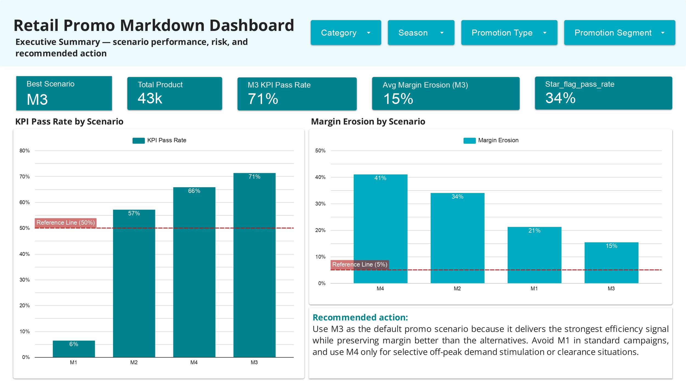
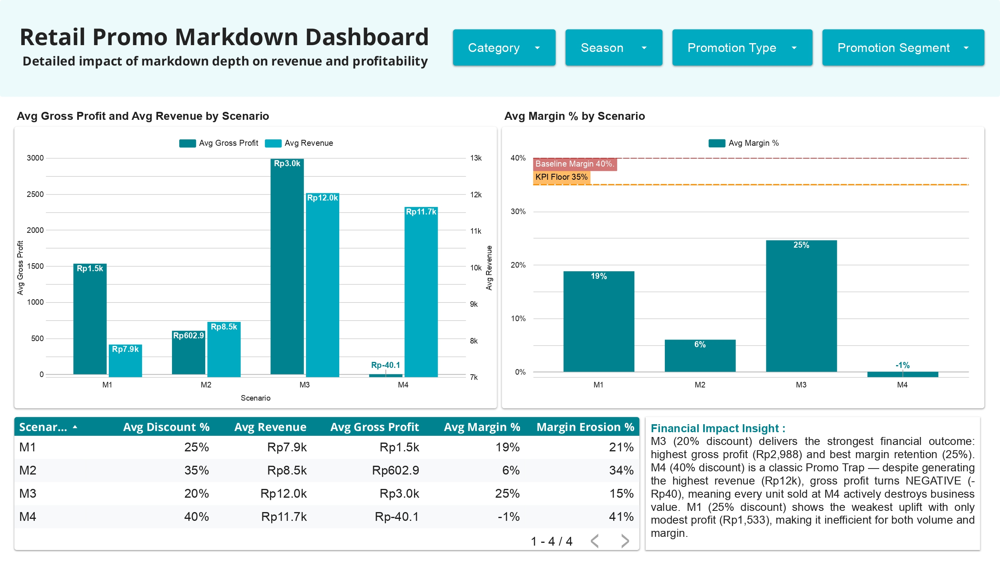
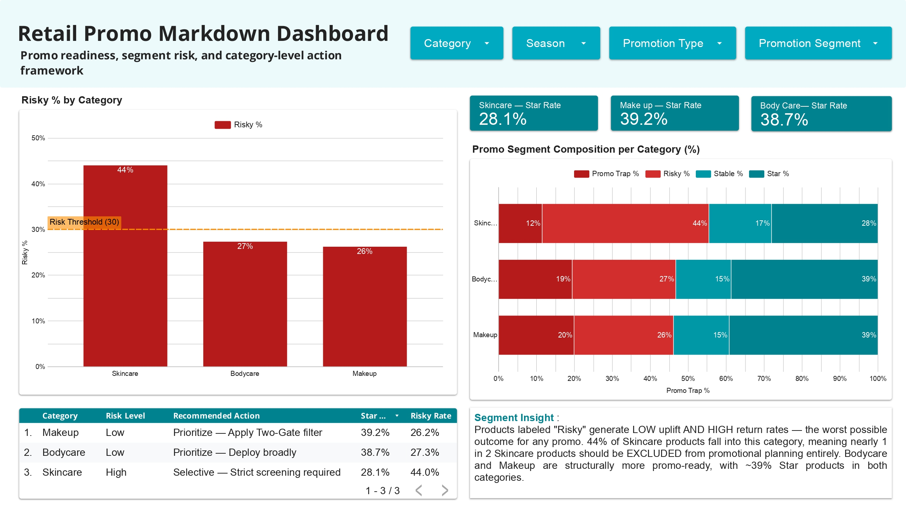
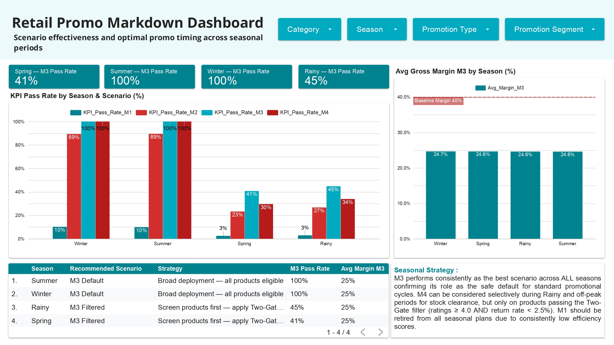

# 🏷️ Retail Promo Markdown Effectiveness Analysis

**Author:** Ananda Anugrah  
**Contact:** [anandanugrah901@gmail.com](mailto:anandanugrah901@gmail.com) | [LinkedIn](https://www.linkedin.com/in/ananda-anugrah-062741387/)

---

## 📌 Executive Summary
Retail companies often rely on deep discounts to drive sales volume, but this strategy frequently erodes gross margins. This project analyzes a dataset of **43,400 retail products** to evaluate four promotional markdown scenarios (M1: 25%, M2: 35%, M3: 20%, M4: 40%). 

The goal is to move beyond traditional "sales uplift" metrics and identify the **true profitability** of each discount tier. By implementing product-level risk segmentation, this analysis provides a data-driven framework to prevent profit loss from ineffective promotions.

👉 **[View Interactive Dashboard on Looker Studio](https://datastudio.google.com/reporting/adb99220-9b5c-44fd-8928-a468c7ec76de)**  
👉 **[View Full Python Analysis Notebook](https://colab.research.google.com/drive/1L2gpwY8G9ZiwXYyL5-Lq6dE4pILUalEb?usp=sharing)**

---

## 📊 Interactive Dashboard Preview
*(A 4-page executive dashboard built to monitor scenario performance, segment risks, and seasonal strategies)*

| Page 1: Executive Summary | Page 2: Scenario Comparison |
|:---:|:---:|
|  |  |
| **Page 3: Category Risk Segmentation** | **Page 4: Seasonal Responsiveness** |
|  |  |

*(Note: Please ensure the image filenames in the `assets/` folder match the names above, e.g., `dashboard_page1.png`)*

---

## 🎯 Business Problem & Objectives
- **The Trap of Volume:** Do deeper discounts actually generate incremental profit, or do they just buy expensive, low-quality sales?
- **Budget Allocation:** Which product categories (Skincare, Bodycare, Makeup) are most responsive to promotions?
- **Risk Mitigation:** How can we identify "Promo Trap" products (high uplift but high return rate) before deployment?

## 💡 Key Business Insights
1. **The M4 Promo Trap:** Scenario M4 (40% discount) generated the highest gross revenue (**Rp11.7k**), but completely destroyed profitability, resulting in a **negative gross margin (-1.0%)**.
2. **The M3 Sweet Spot:** Scenario M3 (20% discount) delivered the best financial compromise, maintaining a **25% gross margin** while yielding the highest average gross profit (**Rp3.0k**).
3. **Category Risk:** **44% of Skincare products** fell into the "Risky" segment (low uplift + high return rate), requiring strict product-level screening before any promo activation.
4. **Seasonal Variance:** M3 achieved a **100% KPI Pass Rate** during High Season (Summer/Winter), but dropped to **~45%** during Low Season (Rainy/Spring).

## 🛠️ Methodology & Tech Stack
- **Tools:** Python (Pandas, Seaborn, Matplotlib), Google Colab, Looker Studio.
- **Data Processing:** Handled 43k+ rows, executed deduplication, IQR outlier flagging, and feature engineering (Uplift Ratio, Margin Erosion %, Promo Efficiency Score).
- **Segmentation:** Developed a custom quadrant analysis separating products into *Star, Stable, Promo Trap,* and *Risky* categories based on uplift and return rates.

## 📋 Recommended Action Framework
Based on the analysis, the following operational guidelines are recommended:
* **Make M3 the Default:** Deploy M3 (20%) as the standard promotional baseline across all active seasons.
* **Retire M1:** Stop using M1 (25%), as it showed consistently weak efficiency across all metrics.
* **Implement a "Two-Gate" Filter for Low Seasons:** During Rainy & Spring seasons, before promoting any product, it must pass a strict threshold: `Customer Rating ≥ 4.0` AND `Return Rate < 2.5%`.

---
*Note: This analysis uses a simulated dataset to demonstrate analytical methodology and commercial reasoning.*
